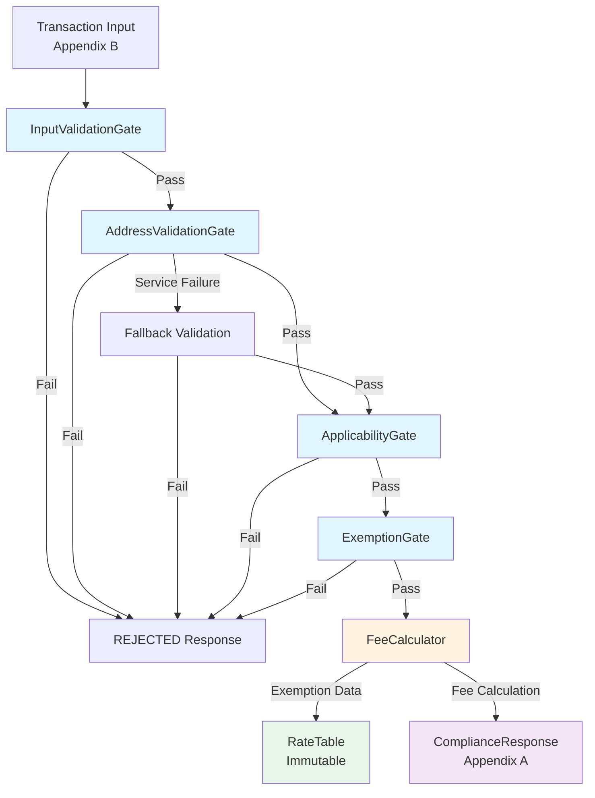

# Compliance Engine Architecture

## Overview

The Compliance Engine is a rule-based system that processes e-commerce transactions through a sequential gate pipeline to determine fee applicability and calculate compliance fees. The system is designed with clear separation of concerns, extensibility, and observability in mind.

## System Architecture Diagram



## Component Design

### 1. Input Validation Layer

**Component:** `InputValidationGate`

**Responsibilities:**
- Validates transaction input structure (required fields, types)
- Verifies data consistency (items sum = totalAmount)
- Validates currency (USD only)
- Ensures non-negative amounts

**Output:** GateResult with errorType: 'VALIDATION' on failure

**Note:** This gate is internal-only and does not appear in the API response (not in Appendix A).

### 2. Address Validation Layer

**Component:** `AddressValidationGate`

**Responsibilities:**
- Validates destination against supported jurisdictions
- Simulates external service call with timeout handling
- Implements fallback validation when external service fails
- Caches validation results for performance

**Resilience Pattern:**
- Timeout + fallback (not a full circuit breaker)
- Falls back to local validation rules on service failure
- Error type: 'DEPENDENCY' when service fails

### 3. Applicability Layer

**Component:** `ApplicabilityGate`

**Responsibilities:**
- Checks merchant volume thresholds
- Determines if compliance rules apply to the transaction
- Returns pass/fail based on merchant presence requirements

**Output:** GateResult with merchant volume metadata

### 4. Exemption Layer

**Component:** `ExemptionGate`

**Responsibilities:**
- Identifies customer-level exemptions (e.g., WHOLESALE)
- Identifies item-level exemptions (e.g., FOOD in CA)
- Returns exemption data structure (does NOT calculate fees)

**Important:** This gate only identifies exemptions. The calculator consumes this data and applies exemptions during fee calculation.

**Output:** GateResult with exemptionData metadata and appliedExemptions array

### 5. Calculation Layer

**Component:** `FeeCalculator` + `RateTable`

**Responsibilities:**
- Applies state, county, city, and category modifier rates
- Consumes exemption data from ExemptionGate
- Calculates per-item fees with precision handling
- Ensures sum(item fees) = total fees (critical for 47+ items)

**RateTable:**
- Immutable, read-only rate lookup table
- Loaded once at startup
- No mutation during execution

**Precision Handling:**
- Uses `decimal.js` for precise decimal arithmetic
- Rounds only at final total calculation
- Verifies: `Math.abs(sum(itemFees) - totalFees) < 0.01`

### 6. Orchestration Layer

**Component:** `ComplianceEngine` + `GateOrchestrator`

**Responsibilities:**
- Executes gates sequentially
- Short-circuits on first gate failure
- Transforms internal GateResult to API GateEntry format
- Formats response to match Appendix A exactly
- Generates audit trail

## Gate Pattern Implementation

### Sequential Execution with Short-Circuit

Gates execute in a fixed order:
1. InputValidationGate (internal)
2. AddressValidationGate
3. ApplicabilityGate
4. ExemptionGate

Any gate failure immediately stops processing and returns a REJECTED response.

### Gate Result Contract

**Internal GateResult:**
```typescript
{
  gateName: string;        // Internal name (e.g., "AddressValidation")
  passed: boolean;
  message?: string;
  metadata?: Record<string, unknown>;
  errorType?: 'VALIDATION' | 'DEPENDENCY' | 'SYSTEM';
}
```

**API GateEntry (Appendix A):**
```typescript
{
  name: string;            // Public name (e.g., "ADDRESS_VALIDATION")
  passed: boolean;
  message?: string;
  appliedExemptions?: string[];  // Only for EXEMPTION_CHECK
}
```

### Registry-Based Gate System

Gates are registered in `GateOrchestrator` constructor. New gates can be added without modifying the orchestrator (extensibility), but this is not a runtime plugin system.

## Why Gate Pattern Instead of Rules Engine DSL?

### 1. Deterministic Execution Flow

**Gate Pattern:** Sequential, predictable execution order
- Easy to debug: "Gate X failed" is immediately clear
- Execution order is explicit in code
- No hidden rule evaluation logic

**Rules Engine DSL:** Rule evaluation order may be non-deterministic
- Harder to debug: "Which rule fired?" requires tracing
- Rule priority and evaluation order can be ambiguous
- Complex rule interactions

### 2. Explicit Checkpoints

**Gate Pattern:** Each gate is a clear checkpoint
- Failure point is obvious: "AddressValidationGate failed"
- Easy to add logging/observability at each checkpoint
- Clear separation between validation, applicability, exemptions, calculation

**Rules Engine DSL:** Rules may fire in unexpected order
- Failure point may be unclear: "Some rule failed"
- Harder to instrument for observability
- Rules may overlap in responsibility

### 3. Easier Unit Testing

**Gate Pattern:** Each gate is independently testable
- Test InputValidationGate with various invalid inputs
- Test AddressValidationGate with different addresses
- Mock dependencies easily (e.g., external service)

**Rules Engine DSL:** Rules may have complex interdependencies
- Testing individual rules may require full rule context
- Rule interactions make isolation difficult

### 4. Lower Cognitive Load

**Gate Pattern:** Sequential flow is easy to understand
- Code reads like: "Validate input → Validate address → Check applicability → Check exemptions → Calculate fees"
- New developers can understand the flow quickly

**Rules Engine DSL:** Rule evaluation logic may be opaque
- Requires understanding the rule engine's evaluation strategy
- Rule interactions may not be obvious from reading rules

### 5. Better Observability

**Gate Pattern:** Gate-level metrics and logging
- "AddressValidationGate took 50ms"
- "ApplicabilityGate failed 2% of the time"
- Clear audit trail: "Gate X passed/failed with message Y"

**Rules Engine DSL:** Rule-level observability may be limited
- "Which rules fired?" may require complex tracing
- Rule evaluation metrics may be less meaningful

## Extensibility Strategy

### Adding New Gates

1. Create new gate class extending `BaseGate`
2. Implement `execute()` method returning `GateResult`
3. Register in `GateOrchestrator` constructor
4. No changes needed to orchestrator logic

**Example:**
```typescript
class NewValidationGate extends BaseGate {
  protected getGateName(): string { return 'NewValidation'; }
  async execute(transaction: TransactionInput): Promise<GateResult> {
    // Implementation
  }
}
```

### Adding New Rule Types

- **Rate changes:** Update `RateTable` configuration (immutable, requires restart)
- **Exemption rules:** Update `rules.ts` configuration
- **Merchant thresholds:** Update `MERCHANT_VOLUMES` map

**Future:** Could evolve to database-driven configuration, but current scope uses hardcoded config.

## Observability

### Structured Logging

Each gate logs:
- Execution start/end
- Pass/fail status
- Execution time
- Error details (if failed)

### Audit Trail

The response includes an `auditTrail` array with:
- Gate execution results
- Fee calculation details
- Exemption applications
- Rate applications

**Example:**
```
[
  "Address validated via cache",
  "Merchant volume: $2.3M in CA (threshold: $100K)",
  "No exemptions applied",
  "Applied CA state rate: 6%",
  "Applied LA County rate: 0.25%",
  "Applied LA City rate: 2.25%",
  "Applied SOFTWARE category modifier: 1%"
]
```

### Future Metrics

Structured logs enable future metrics extraction:
- Gate pass/fail rates
- Gate execution times
- Fee calculation statistics
- Exemption application rates

**Note:** Metrics are not implemented in current scope, but architecture supports them.

## Error Handling & Resilience

### Error Categorization

- **VALIDATION:** Input validation failures, business rule violations
- **DEPENDENCY:** External service failures, timeout
- **SYSTEM:** Internal errors, unexpected failures

### Resilience Patterns

#### Address Validation Service Failure

**Pattern:** Timeout + Fallback (inspired by circuit breakers, not full implementation)

**Behavior:**
1. Attempt external service call with timeout (100ms)
2. On timeout/failure, fall back to local validation rules
3. Cache result for future requests
4. Return DEPENDENCY error type if fallback also fails

**Why not full circuit breaker?**
- No shared state across instances
- No failure threshold tracking
- No half-open state
- Simpler implementation for current scope

**Future:** Could evolve to full circuit breaker if needed.

### Graceful Degradation

- External service failure → Fallback to local rules
- Missing rate data → Default to 0% (with audit trail)
- Invalid input → Clear error message in response

## API Contracts

### Input (Appendix B)

```typescript
{
  transactionId: string;
  merchantId: string;
  customerId: string;
  destination: {
    country: string;
    state: string;
    city: string;
  };
  items: Array<{
    id: string;
    category: string;
    amount: number;
  }>;
  totalAmount: number;
  currency: string;
}
```

### Output (Appendix A)

```typescript
{
  transactionId: string;
  status: 'CALCULATED' | 'REJECTED' | 'FAILED';
  gates: Array<{
    name: 'ADDRESS_VALIDATION' | 'APPLICABILITY' | 'EXEMPTION_CHECK';
    passed: boolean;
    message?: string;
    appliedExemptions?: string[];  // Only for EXEMPTION_CHECK
  }>;
  calculation?: {
    items: Array<{
      itemId: string;
      amount: number;
      category: string;
      fees: {
        stateRate: { jurisdiction: string; rate: number; amount: number };
        countyRate?: { jurisdiction: string; rate: number; amount: number };
        cityRate?: { jurisdiction: string; rate: number; amount: number };
        categoryModifier: { category: string; rate: number; amount: number };
      };
      totalFee: number;
    }>;
    totalFees: number;
    effectiveRate: number;
  };
  auditTrail: string[];
}
```

## Data Flow

1. **Input Validation:** Transaction input → Validated transaction
2. **Address Validation:** Validated transaction → Validated address (or failure)
3. **Applicability:** Validated transaction → Applicable (or failure)
4. **Exemption Check:** Validated transaction → Exemption data
5. **Fee Calculation:** Transaction + Exemption data → Fee calculation
6. **Response Formatting:** Gate results + Calculation → Appendix A response

## Testing Strategy

### Unit Tests
- Each gate tested independently
- FeeCalculator tested with various scenarios
- Precision handling tested with 47+ items

### Integration Tests
- End-to-end transaction processing
- Gate failure scenarios
- External service failure scenarios

### Contract Tests
- Verify exact response structure matches Appendix A
- Verify gate names match specification
- Verify fee structure matches specification

## Future Improvements

1. **Database Integration:** Load rates from database instead of hardcoded config
2. **Caching Layer:** Redis cache for address validation results
3. **Metrics:** Extract metrics from structured logs
4. **Multi-Currency:** Support currencies beyond USD
5. **Plugin Architecture:** Runtime plugin loading for gates (not in current scope)
6. **Circuit Breaker:** Full circuit breaker implementation for external services

## Assumptions & Simplifications

1. **Hardcoded Configuration:** Rates, thresholds, exemptions are hardcoded (vs. database/API)
2. **USD Only:** Only USD currency supported
3. **Mock External Services:** Address validation service is simulated
4. **Simplified Merchant Data:** Merchant volumes are hardcoded
5. **Single Instance:** No distributed state (circuit breaker would need shared state)


