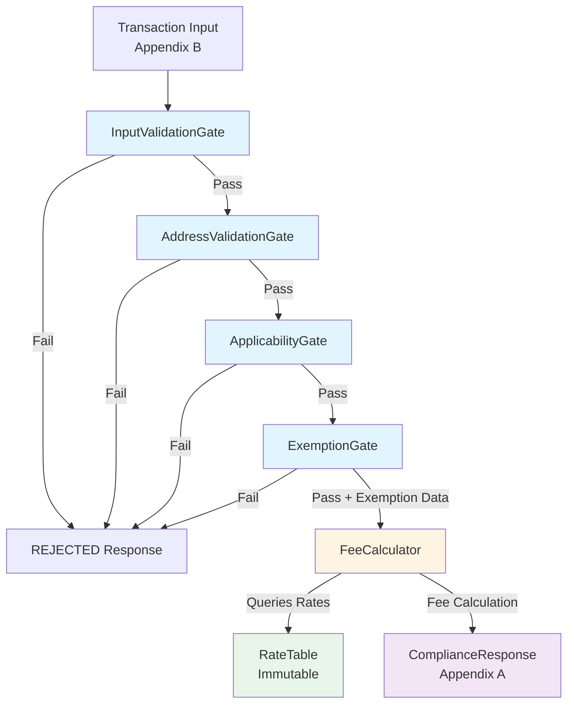

# Compliance Engine Architecture

## Overview

The Compliance Engine is a rule-based system that processes e-commerce transactions through a sequential gate pipeline to determine fee applicability and calculate compliance fees. The system is designed with clear separation of concerns, extensibility, and observability in mind.

## System Architecture Diagram



## Component Design

### 1. Input Validation Layer

**Component:** `InputValidationGate`

**Responsibilities:**
- Validates transaction input structure (required fields, types)
- Verifies data consistency (items sum = totalAmount)
- Validates currency (USD only)
- Ensures non-negative amounts

**Output:** GateResult with errorType: 'VALIDATION' on failure

**Note:** This gate is internal-only and does not appear in the API response (not in Appendix A).

### 2. Address Validation Layer

**Component:** `AddressValidationGate`

**Responsibilities:**
- Validates destination against supported jurisdictions using database queries
- Checks in-memory cache first for performance optimization
- Calls database service with 5-second timeout handling
- Caches validation results (state:city combinations) for future requests
- Returns DEPENDENCY error when database service is unavailable

**Resilience Pattern:**
- Cache-first strategy to reduce database load
- Database service timeout (5 seconds) to prevent hanging requests
- On database failure (timeout or error), rejects transaction with DEPENDENCY error type
- No fallback validation - system requires database service availability

### 3. Applicability Layer

**Component:** `ApplicabilityGate`

**Responsibilities:**
- Checks merchant volume thresholds
- Determines if compliance rules apply to the transaction
- Returns pass/fail based on merchant presence requirements

**Output:** GateResult with merchant volume metadata

### 4. Exemption Layer

**Component:** `ExemptionGate`

**Responsibilities:**
- Identifies customer-level exemptions (e.g., WHOLESALE)
- Identifies item-level exemptions (e.g., FOOD in CA)
- Returns exemption data structure (does NOT calculate fees)

**Important:** This gate only identifies exemptions. The calculator consumes this data and applies exemptions during fee calculation.

**Output:** GateResult with exemptionData metadata and appliedExemptions array

### 5. Calculation Layer

**Component:** `FeeCalculator` + `RateTable`

**Responsibilities:**
- Applies state, county, city, and category modifier rates
- Consumes exemption data from ExemptionGate
- Calculates per-item fees with precision handling
- Ensures sum(item fees) = total fees (critical for 47+ items)

**RateTable:**
- Immutable, read-only rate lookup table
- Loaded once at startup from database
- No mutation during execution
- Initialized via `RateTable.initialize()` which loads rates from PostgreSQL

**Precision Handling:**
- Uses `decimal.js` for precise decimal arithmetic
- Rounds only at final total calculation
- Verifies: `Math.abs(sum(itemFees) - totalFees) < 0.01`

### 6. Orchestration Layer

**Component:** `ComplianceEngine` + `GateOrchestrator`

**Responsibilities:**
- Executes gates sequentially
- Short-circuits on first gate failure
- Transforms internal GateResult to API GateEntry format
- Formats response to match Appendix A exactly
- Generates audit trail

## Gate Pattern Implementation

### Sequential Execution with Short-Circuit

Gates execute in a fixed order:
1. InputValidationGate (internal)
2. AddressValidationGate
3. ApplicabilityGate
4. ExemptionGate

Any gate failure immediately stops processing and returns a REJECTED response.

### Gate Result Contract

**Internal GateResult:**
```typescript
{
  gateName: string;        // Internal name (e.g., "AddressValidation")
  passed: boolean;
  message?: string;
  metadata?: Record<string, unknown>;
  errorType?: 'VALIDATION' | 'DEPENDENCY' | 'SYSTEM';
}
```

**API GateEntry (Appendix A):**
```typescript
{
  name: string;            // Public name (e.g., "ADDRESS_VALIDATION")
  passed: boolean;
  message?: string;
  appliedExemptions?: string[];  // Only for EXEMPTION_CHECK
}
```

### Registry-Based Gate System

Gates are registered in `GateOrchestrator` constructor. New gates can be added without modifying the orchestrator (extensibility), but this is not a runtime plugin system.

## Error Handling & Resilience

### Error Categorization

- **VALIDATION:** Input validation failures, business rule violations
- **DEPENDENCY:** External service failures, timeout
- **SYSTEM:** Internal errors, unexpected failures

### Resilience Patterns

#### Address Validation Service Failure

**Pattern:** Cache-First with Database Service Timeout

**Behavior:**
1. Check in-memory cache first (key: "state:city")
2. If cache miss, attempt database service call with 5-second timeout
3. On successful database response, cache result (valid/invalid)
4. On database timeout or error, reject transaction with DEPENDENCY error type
5. No fallback validation - system requires database service availability

**Error Handling:**
- Database service failures (timeout, connection errors) result in DEPENDENCY error
- Transaction is rejected when database service is unavailable
- Error details logged for monitoring purposes

**Cache Strategy:**
- Simple in-memory cache (no expiration)
- Cache key format: "state:city"
- Reduces database load for frequently validated addresses

### Graceful Degradation

- Database service failure → Reject with DEPENDENCY error (requires service availability)
- Cache hits → Avoid database calls for previously validated addresses
- Missing rate data → Default to 0% (with audit trail)
- Invalid input → Clear error message in response

## Data Flow

1. **Input Validation:** Transaction input → Validated transaction
2. **Address Validation:** Validated transaction → Validated address (or failure)
3. **Applicability:** Validated transaction → Applicable (or failure)
4. **Exemption Check:** Validated transaction → Exemption data
5. **Fee Calculation:** Transaction + Exemption data → Fee calculation
6. **Response Formatting:** Gate results + Calculation → Appendix A response


